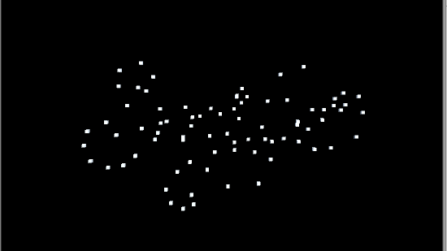
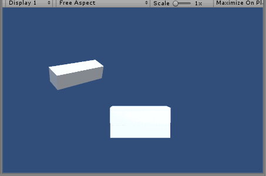
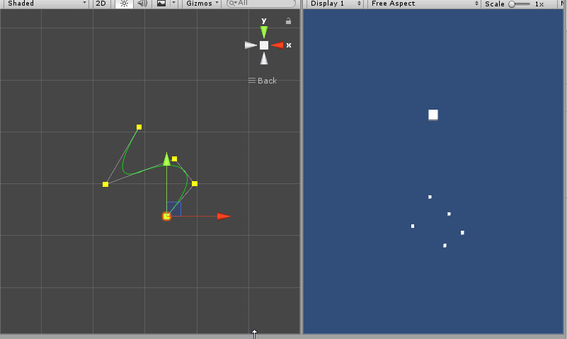

# Unity Scripting Utilities
    
Stuff I use a lot, and a simple AnimationCurve-based tweening interface.   

Add to projects using:  
`git submodule add https://github.com/williamrjackson/UnityScriptingUtilities.git Assets\ScriptingUtils`


## MapToCurve
Provides values as plotted on an Animation Curve. Used a lot like Mathf.Lerp, except not linear. 

Includes a bunch of functions to manipulate transforms/audio over time. For example, the following will scale, move and rotate a transfrom into a position over 5 seconds. The target position is defined by a sibling transfrom.

Presets for common ease curves from https://github.com/nobutaka/EasingCurvePresets are included
```C#
   Wrj.Utils.MapToCurve.Ease.MatchSibling(transform, targetTransform, 5);
//                       ^        ^          ^            ^           ^
//                     curve   function   affected   destination   duration
```
#### Manipulation Functions
```
Scale
Move (local space)
MoveWorld (world space)
MoveAlongPath
Rotate
FadeAudio
CrossfadeAudio (smoothly transitions between two audio sources)
FadeAlpha
ChangeColor
MatchSibling
```
#### Arguments & Common Modifiers
```
tForm          - Transform to affect
to             - Target destination/rotation/volume/etc.
duration       - Length of time in seconds for the manipulation to complete. 
                 Applies to a single loop/pingPong iteration
mirrorCurve    - Swap the in/out curve shapes. 
                 Get EaseOut by combining the EaseIn curve  with this flag
loop           - Repeat the manipulation this many times
pingPong       - Repeat the manipulation forward, then backward, this many times
mirrorPingPong - pingPong, but inverts the curve when performing backward manipulations
useTimeScale   - Set this to false to ignore global time scaling
shortestPath   - In the case of manipulations that include rotation, this will cause minimal
                 possible rotation to get to the target. Without this, a rotation difference > 360 
                 will result in a full positive rotation before reaching the target.
onDone         - Specify a function to call when the operation completes
```
There are simplified GameObject and Transform Extension Methods for linear and ease manipulations:
```
transform.Move(destination, duration);
transform.EaseMove(destination, duration);
transform.Rotate(targetRotation, duration);
transform.EaseRotate(targetRotation, duration);
transform.Scale(targetScale, duration);
transform.EaseScale(TargetScale, duration);
transform.SnapToSibling(targetSibling, duration);
transform.EaseSnapToSibling(targetSibling, duration);
transform.Color(desiredColor, duration);
transform.Alpha(desiredAlpha, duration);
```
    
#### Test Bed Example
```C#
float duration = 4.0f

// Black Cube
Vector3 blackTargetPos = blackTransform.localPosition + Vector3.up * 5 + Vector3.right * -1.5f;
Vector3 blackTargetRot = Vector3.up * 135;

Wrj.Utils.MapToCurve.Linear.Move(blackTransform, linTargetPos, duration, pingPong: 10);
Wrj.Utils.MapToCurve.Linear.Rotate(blackTransform, blackTargetRot, duration, shortestPath: false, pingPong: 10);
Wrj.Utils.MapToCurve.Ease.ChangeColor(blackTransform, Color.black, duration, pingPong: 10);

// Red Cube
Vector3 redTargetPos = redTransform.localPosition + Vector3.up * 5 + Vector3.right * .5f;
Vector3 redTargetRot = Vector3.up * -360;

Wrj.Utils.MapToCurve.EaseIn.Move(redTransform, redTargetPos, duration, mirrorCurve: false, pingPong: 10);
Wrj.Utils.MapToCurve.EaseIn.Rotate(redTransform, redTargetRot, duration, shortestPath: false, pingPong: 10);
Wrj.Utils.MapToCurve.Ease.ChangeColor(redTransform, Color.red, duration, pingPong: 10);

// Blue Cube
Vector3 blueTargetPos = blueTransform.localPosition + Vector3.up * 5 + Vector3.right * -.5f;
Vector3 blueTargetRot = Vector3.forward * -720;

Wrj.Utils.MapToCurve.EaseIn.Move(blueTransform, blueTargetPos, duration, mirrorCurve: true, pingPong: 10);
Wrj.Utils.MapToCurve.EaseIn.Rotate(blueTransform, blueTargetRot, duration, shortestPath: false, mirrorPingPong: 10);
Wrj.Utils.MapToCurve.Ease.ChangeColor(blueTransform, Color.blue, duration, pingPong: 10);

// Purple Cube
Wrj.Utils.MapToCurve.Ease.MatchSibling(purpleTransform, targetTransform, duration, pingPong: 10);
Wrj.Utils.MapToCurve.Ease.ChangeColor(purpleTransform, Color.magenta, duration, pingPong: 10);

// Purple Cube's Target
Wrj.Utils.MapToCurve.Ease.FadeAlpha(targetTransform, 0, duration, pingPong: 10);

```
## WeightedGameObjects
Also includes a Weighted Random GameObject class (demonstrated on the right in the gif above).

Each GameObject in an array gets an int representing its weight. Higher weights are more likely for selection When `WeightedGameObjects.GetRandom()` is called.

## Utility Functions
- `EnsureComponent<T>(GameObject)`
  - Returns a component instance by finding the one on the game object, or by adding one if not found.
- `Delay(delayTime, () => Method(withParams))`
  - Issues a command after the specified delayTime elapses.
- `Switcheroo<T>(ref T a, ref T b)`
  - Swap items
- `AffectGORecursively(GameObject, AnyFunctionThatTakesAGameObj)`
  - Call AnyFunctionThatTakesAGameObj for GameObject and all of it's children.
- `GetPositiveAngle(float OR Vector3)`
  - Ensure an angle in degrees is within 0 - 360
- `Remap(value, sourceMin, sourceMax, destMin, destMax)`
  - Linearly remaps a value from a source range to a desired range
- `QuadraticBezierCurve(origin, influence, destination, pointCount)`
  - Get an array of points representing a quadratic bezier curve. 
- `CubicBezierCurve(origin, influenceA, influnceB, destination, pointCount)`
  - Get an array of points representing a cubic bezier curve. 
- `FromFeet(feet)`
  - Convert feet into Unity Units. Because I'm a silly American that can only visualise space in US standard units.
- `FromInches(inches)`
  - Convert inches into Unity Units.    
- `FromInches(inches)`
  - Convert inches into Unity Units.    
- `String.PrependAn(capitalize)`
  - Prepends either "A" or "An" depending on the word.    
- `List.GetRandom()` and `Array.GetRandom()`
  - Returns a random element from an array or list.    

## Bezier Path Editor 
Editor scripts to create paths. `MapToCurve` includes a tween to follow paths over a duration using a speed curve.

    

## 3D Layout Groups
Basic object distribution scripts that runs in edit mode, dynamically adapting to changes in the child hierarchy. Similar to UI Layout Groups, but for 3D transforms. 

## CustomLog 
UnityEngine.Debug.Log wrapper allowing you to subscribe to log updates, to change in-game Text for example. Inspired by the need to see the Debug.Log entries within a VR experience, without ruining the ability to doubleclick the item in the Unity Console. Also provides the ability to colorize in the Console. Usage: `Wrj.CustomLog.Log("Test", Color.cyan)`. Add `CustomLogTextUpdate` component to an object containing a `TMPro.TextMeshProUGUI`, `UnityEngine.UI.Text` or `TextMesh` to update text each time `CustomLog.Log()` is called.
