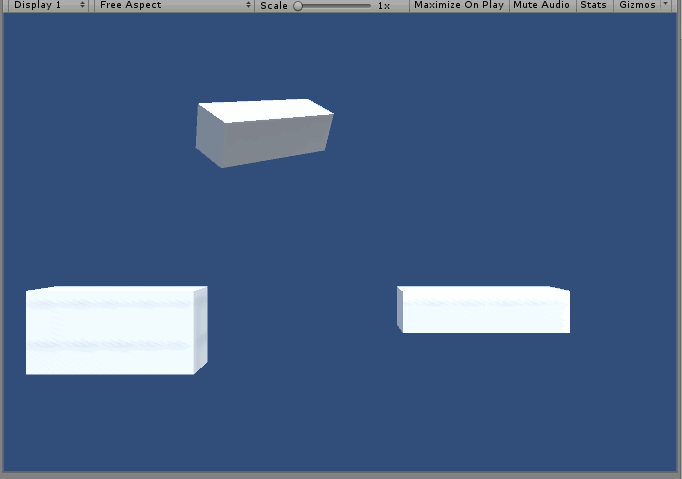
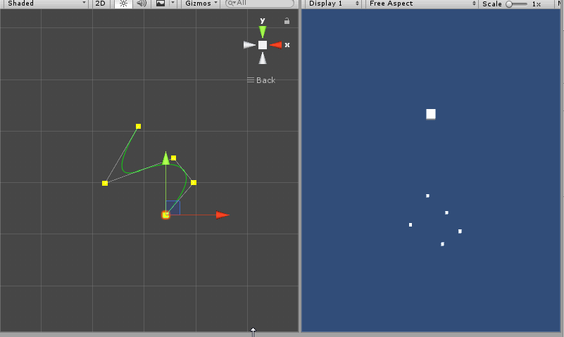
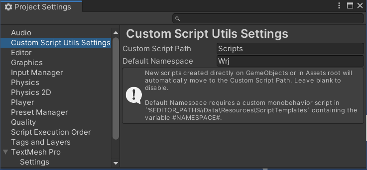

# Unity Scripting Utilities

A curated collection of reusable scripting utilities for Unity projects.

This package provides lightweight, production-tested helpers for: -
AnimationCurve-based tweening and easing - Transform and UI utilities -
Object and audio pooling - Weighted random selection - Bezier paths and
editor helpers - General-purpose gameplay utilities

Designed for rapid prototyping, interactive installations, tools, and
full-scale game systems.

------------------------------------------------------------------------

## Installation

### Via Unity Package Manager (Git URL)

In Unity: `Window → Package Manager → + → Add package from Git URL`

Use:

    https://github.com/williamrjackson/UnityScriptingUtilities.git

Optionally lock to a specific tag:

    https://github.com/williamrjackson/UnityScriptingUtilities.git#v1.6

------------------------------------------------------------------------

## Screenshots & GIFs

The repository includes demonstration GIFs and screenshots. These are kept in
Documentation~ so they don’t bloat the UPM package.

Example embedded media (uses existing repository assets):

### Tweening Example



### Path Follower Example



### Presets Screenshot



------------------------------------------------------------------------

## Core Features

### Tweening & Easing (AnimationCurve-Based)

Extension methods for clean, readable motion code:

``` csharp
transform.Move(destination, duration);
transform.EaseRotate(targetRotation, duration);
transform.EaseScale(targetScale, duration);
```

Supported operations include: - Move / MoveWorld - Rotate - Scale -
MoveAlongPath - FadeAudio / CrossfadeAudio - FadeAlpha / ChangeColor -
SnapToSibling / EaseSnapToSibling

Curves can be mirrored, ping-ponged, or customized.

------------------------------------------------------------------------

### Weighted Random Selection

Select elements with weighted probabilities:

``` csharp
var weighted = new WeightedElements<string>();
weighted.Add("Common", 70);
weighted.Add("Rare", 25);
weighted.Add("Epic", 5);

string result = weighted.GetRandom();
```

------------------------------------------------------------------------

### Object Pooling

Efficient GameObject reuse to reduce instantiation overhead.

### Audio Pool

Play multiple overlapping sound effects without audio artifacts.

------------------------------------------------------------------------

## Utility Helpers

Includes helpers such as:

-   EnsureComponent`<T>`()
-   DeferredExecution
-   Switcheroo`<T>`()
-   AffectGORecursively
-   Random element selection helpers
-   Coin flip helpers
-   Bezier utilities
-   Unit converters (FromFeet, FromInches)
-   Screen size notifications
-   Custom logging tools

------------------------------------------------------------------------

## Project Structure

    Audio/
    Editor/
    LayoutGroups/
    Paths/
    WrjUtils.cs
    PoolManager.cs
    ScreenSizeNotifier.cs
    ...

------------------------------------------------------------------------

## Compatibility

-   Unity 2022.3+
-   No external dependencies

------------------------------------------------------------------------

## Contributing

Issues and pull requests are welcome.

------------------------------------------------------------------------

## License

MIT License
