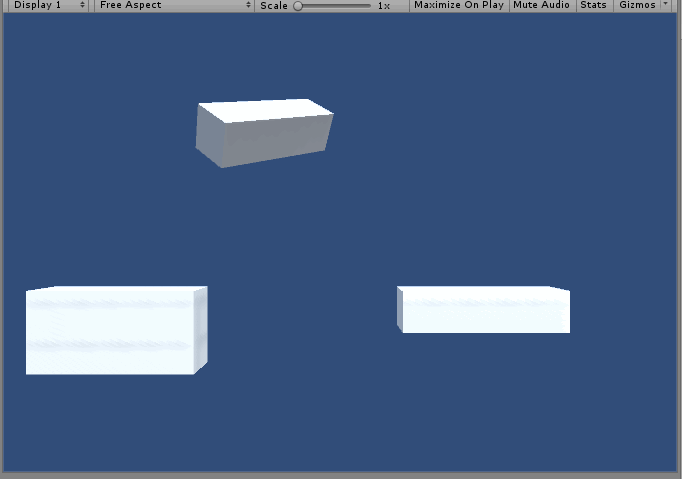

# UnityScriptingUtilities
Stuff I use a lot, and a simple AnimationCurve-based tweening interface. Provides values as plotted on an Animation Curve. Used a lot like Mathf.Lerp, except not linear. 

Includes a bunch of functions to manipulate transforms/audio over time.

    
